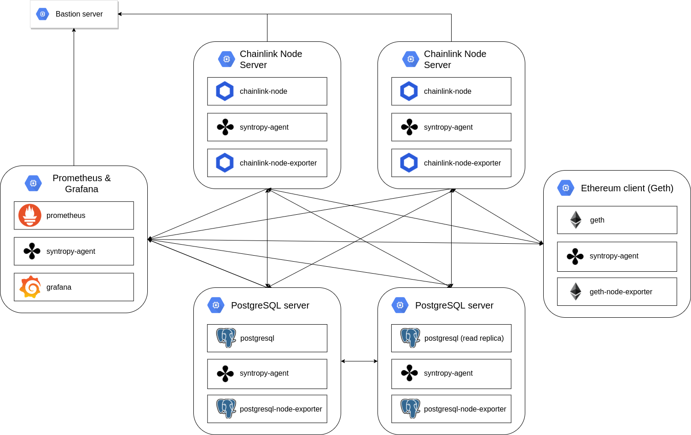

# Set up a node using Syntropy Platform

Setting up a node using OpenVPN, multiple cloud providers, custom failover
solutions and other recommended security practices is really cumbersome.
By using Syntropy Platform and the example configurations provided, the setup will
only need a few commands from start to finish.

## The core infrastructure needed to run a stable Chainlink node securely

- A Chainlink node
- A PostgreSQL database
- An Ethereum client (or a 3rd party provider)

## Possible attack surfaces in the core infrastructure

If the core infrastructure is left to communicate over the public internet or
a security/firewall is misconfigured, then malicious actors will be able to
exploit any of these parts of the infrastructure.

### Ways how can the Ethereum client can be exploited

- If the Ethereum client is set up on a remote server without any firewall rules
  (which can take a lot of time and steps to set up correctly) - attackers can
  directly communicate with the client and issue malformed/malicious commands,
  perform DoS or even worse remote command execution attacks.
- If the Ethereum client is set up locally - a malicious program or website can
  access the client through `localhost:8565` and as with the previous case,
  execute commands.

### What can go wrong with the Operator UI setup

Firstly, as the documentation recommends, the Operator UI should not be exposed
to the public internet. As with the Ethereum client, the UI is sensitive and
should not be available to the public. The recommended way is to use OpenVPN,
however nowadays OpenVPN is seemed as clunky, slow and inauditable. The current
standard for tunneling is WireGuard, which is lighter (~4k LoC).

## How can Syntropy Platform help you

### How it should be setup

It uses a combination of the Syntropy Platform, Nomad,
Terraform and Ansible to automatically set up a multi-cloud and
multi-availability zone node setup that ensures stability even if one cloud
provider fails.

### Benefits

The provided example configuration will set up a custom network using WireGuard
tunneling that is tailorfit to provide security, stability and performance to
your Chainlink nodes. Syntropy Platform will guarantee the availability of
your Chainlink nodes if the route between your Chainlink and Ethereum clients
goes dark. This is done by constantly checking the health of three routes
(public and two Syntropy routes) and switching over to a healthy route if one is
dead. Because three routes are used for data transmission, there is also the
added benefit of minimized latency, since the Syntropy Agent will automatically
switch to the healthiest route (depending on your parameters - latency,
packet loss).

## Example Chainlink node infrastructure


As we can see, Syntropy allows us to connect services that only need connection
with each other - there is no need for everything to be connected with
everything. This gives us the fine grained control that we need to ensure a
secure Chainlink node setup. For extra stability, there is an extra PostgreSQL
instance that acts as a read replica and allows for failover in case the master
one fails. To gain extra visibility (that a standard Chainlink setup doesn't do)
we have set up special crafted Chainlink node exporters that export node health
data to the Prometheus node, which is then later visualized in Grafana.

## How to run your own nodes:

1. Install and configure Amazon Web Services CLI tool (example on CentOS). You
   will need to enter your AWS service account ID and token.

```
curl "https://awscli.amazonaws.com/awscli-exe-linux-x86_64.zip" -o "awscliv2.zip"
unzip awscliv2.zip
sudo ./aws/install
aws configure
```

2. Install Terraform, Nomad & Ansible (this example is for CentOS users, use your respective distribution's package manager)

```
sudo yum install -y yum-utils
sudo yum-config-manager --add-repo https://rpm.releases.hashicorp.com/RHEL/hashicorp.repo
sudo yum install -y terraform nomad ansible
```

3. Ensure that Ansible's version is at least `2.10` by running `ansible --version`

4. Clone the Syntropy & Chainlink project from Gitlab:

```
git clone https://gitlab.com/syntropynet/chainlink
cd chainlink
```

5. Retrieve your Syntropy agent token from [Syntropy Platform UI](https://platform.syntropystack.com)
6. Setup your variables files that are in `ansible/vars/main.yml`
   and `infrastructure/terraform.tfvars`
7. Run `make setup`
8. Input `yes` into the prompts and enter your sudo password into the `BECOME` prompt.
9. After setting up your nodes, you can use the `env.sh` file to copy and
   paste the environment variables needed to inspect Nomad jobs.
   To inspect your node and job status run the command `nomad job status`
10. Set your DNS server to `127.0.0.1`
11. Visit http://chainlink.chainlink:6688 in your browser to see your Operator UI and login with the credentials defined in `vars/main.yml`
