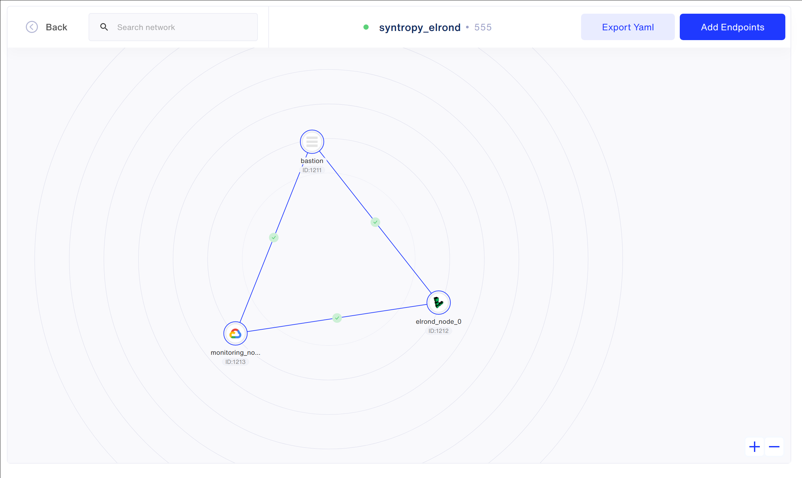
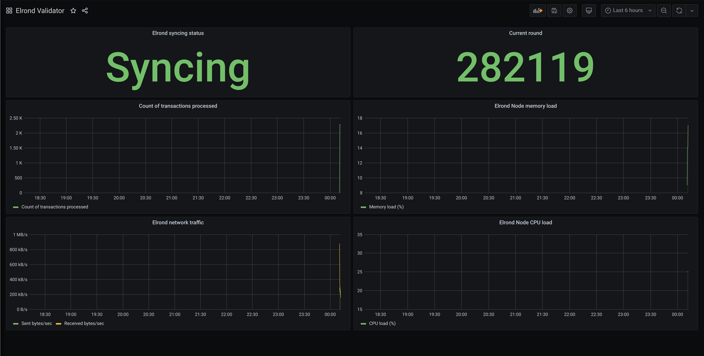
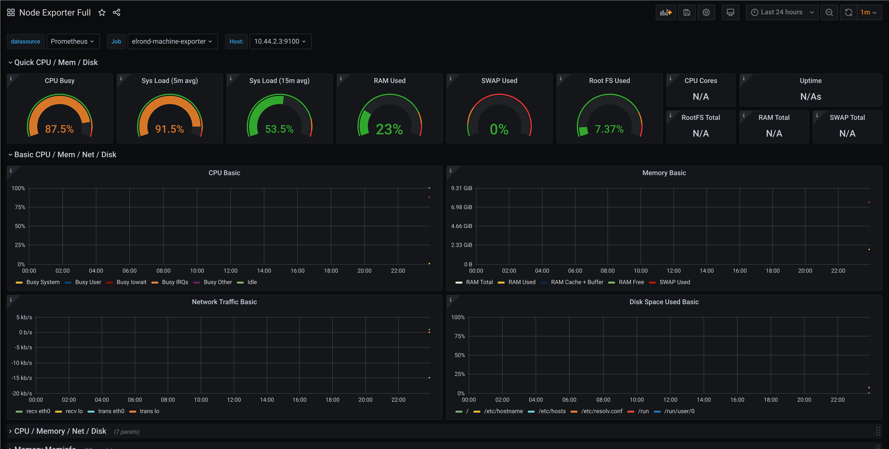

# Setup a secure Elrond validator using the Syntropy Stack

This integration will help Elrond node runners setup a secure and efficient Elrond validator.
It will automatically orchestrate the needed infrastructure and configure
the monitoring solution using Prometheus and Grafana. Since validators
are the sensitive backbone of most blockchains, the connections between
the validators, monitoring and the bastion are made through the Syntropy
private network.

## Requirements

There are some prerequisites to use this example:

* An active Google Cloud Platform account with billing enabled
* An active Linode Cloud account
* Python >= 3.6
* Terraform and Ansible >= 2.10 installed on your local machine
* A Linux machine to run the Ansible playbook and connect to the Elrond Validator

## Recommendations

To make the user experience easier, you can download the Elrond TermUI tool from their Github repository.
In order to be able to compile it, you will need to download the golang package from your desired package manager.

## Installation

For this example, you will need the Syntropy Stack ansible collection
and its dependencies. To install them run:

```
ansible-galaxy collection install git@github.com:SyntropyNet/syntropy-ansible-collection.git
```

To install the collection's dependencies, navigate into the collection directory
and run:
```
pip3 install -U -r requirements.txt
```

## Variables

In order for Terraform and Ansible to be able to set up everything automatically,
you will need to input a few variables in `infra/terraform.tfvars` and 
`ansible/vars/main.yml`. The examples for these can be found in their respective
`.example` files.

Useful links for generating the variables:

1. [How to generate Linode Personal Access Token](https://www.linode.com/docs/guides/getting-started-with-the-linode-api/)
2. [How to generate Google Cloud Platform service key](https://cloud.google.com/iam/docs/creating-managing-service-account-keys)
3. [How to generate a Syntropy Agent Token](https://docs.syntropystack.com/docs/get-your-agent-token)

You will also need to retrieve the latest config and binary version for your Elrond node (that depends on whether you want to run
a node on the main or testnet).

## Provisioning infrastructure

After you have filled in your Terraform and Ansible variables, you can start
creating your virtual machines. This is a simple step and only requires two
commands (in the `infra` directory):

```
terraform init
terraform apply
```

## Deploying the validator and auxilliary services using Ansible

When Terraform is done orchestrating the virtual machines, it automatically
generates the Ansible inventory (so you don't need to). In order to deploy
the Elrond validator together with the monitoring and Syntropy agents,
you will need to run the Ansible playbook (the working directory is now `ansible`).

You can run the playbook using the command:
```
ANSIBLE_HOST_KEY_CHECKING=false ansible-playbook -i inventory.yml main.yml
```

## Checkout the network setup on Syntropy Platform

If configured correctly, the network layout should be simple and look like this:



## Visiting the monitoring site

You can visit the Grafana instance with the link `http://10.44.1.3:3000` and entering
the credentials you entered in the `vars/main.yml` file.

After logging in, you should be able to visit the two dashboards (Validator and node info):



## Checking Elrond validator status

If you have built the TermUI command line utility in the steps above, you should be able to easily check the validator's status.
You can do that by using the command `termui --address 10.44.2.2:8090`.
In my case, the output looks like this:


## Staking your Elrond validator node

Depending on the network you've chosen to run your validator node on, you will either have to have xEGLD or EGLD tokens.
Further information on how to activate/stake your Elrond validator node can be found [here](https://docs.elrond.com/validators/staking/staking-unstaking-unjailing/).
To export your validator key, run the command:

```
scp root@<VALIDATOR_IP>:/home/elrond/elrond-data/keys/validatorKey.pem .
```

You can find the validator IP in the `ansible/inventory.yml` file.
