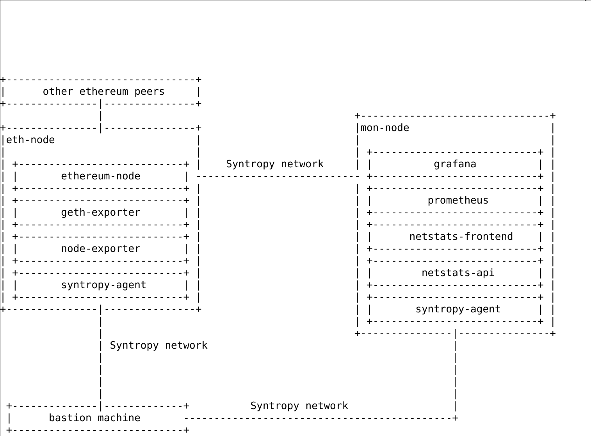
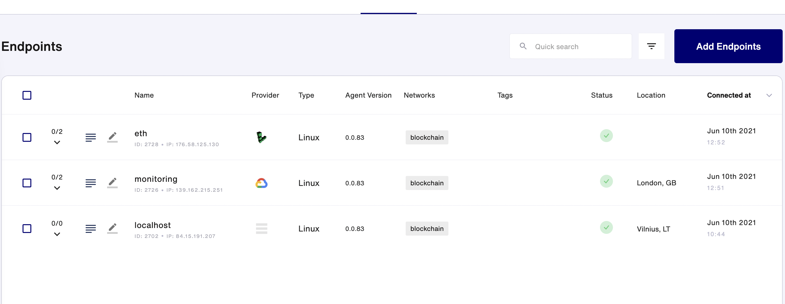
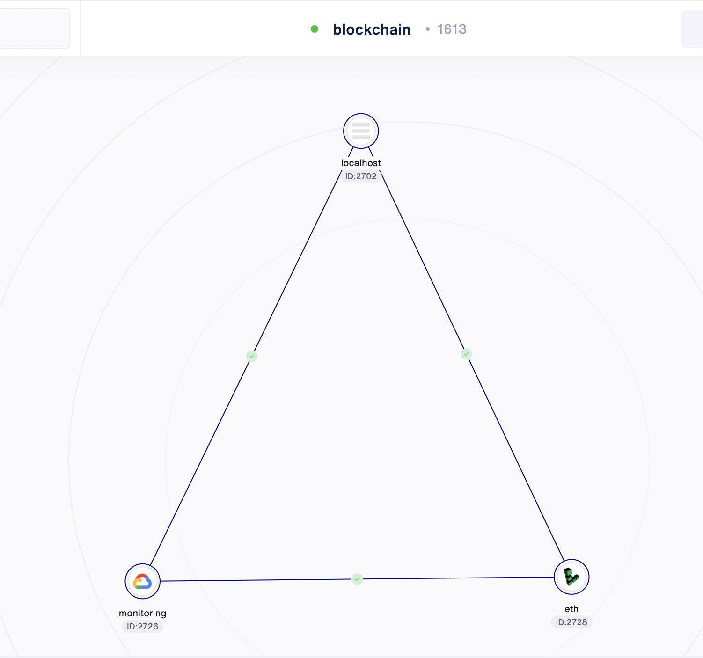
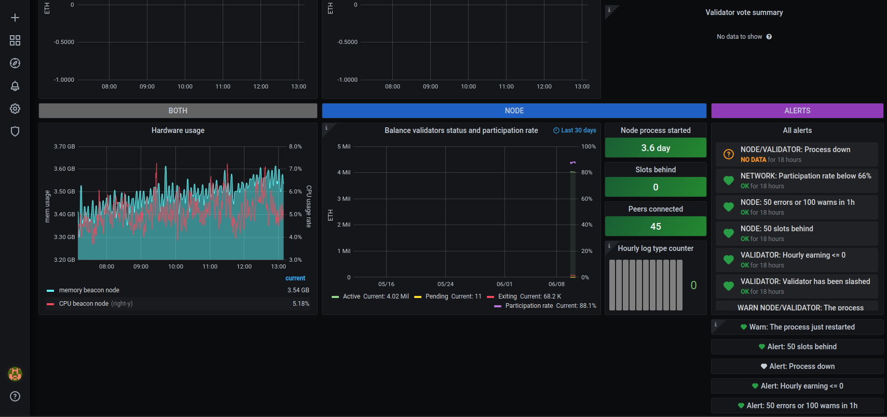

# Setup a secure Ethereum2.0 node using the Syntropy Stack

This integration can help exchanges, on-chain data analysts, node runners, etc. setup a secure, stable and monitored Ethereum2.0 node.
The Ansible playbook configure the Ethereum2.0 node and monitoring. To ensure security and stability all of the connections between the Ethereum2.0 node and the monitoring solution are made through a private Syntropy network.

## Topology



## Benefits

The integration provides a few tangible benefits to different stakeholders:
* Exchanges can now manage their multi-cloud node infrastructure easily without having to worry about network connections and security between the instances.
* Less technical node-runners can easily setup a secure and observable Ethereum2.0 node
* On-chain Ethereum2.0 data analysts can manage Ethereum node clusters on multiple clouds with additional observability

## Requirements

There are some prerequisites to use this example:

* An active Google Cloud Platform account with billing enabled
* An active Linode Cloud account
* Python >= 3.6
* Terraform and Ansible >= 2.10 installed on your local machine
* A Linux machine to run the Ansible playbook


## Variables

In order for Terraform and Ansible to be able to set up everything automatically,
you will need to input a few variables in `infra/terraform.tfvars` and 
`ansible/vars/main.yml`. The examples for these can be found in their respective
`.example` files.

Useful links for generating the variables:

1. [How to generate Linode Personal Access Token](https://www.linode.com/docs/guides/getting-started-with-the-linode-api/)
2. [How to generate Google Cloud Platform service key](https://cloud.google.com/iam/docs/creating-managing-service-account-keys)
3. [How to generate a Syntropy Agent Token](https://docs.syntropystack.com/docs/get-your-agent-token)

### Configure ethereum node
Since Ethereum2.0 node is deploy on top of Ethereum blockchain, we will need a running Ethereum1.0 node. For the sake of this project, we will be using third-party eth1 providers. Instead of running our own eth1 node, it is a lot easier to use a third-party provider such as [Infure](https://infura.io/), [QuickNode](https://www.quiknode.io/), [Chainstack](https://chainstack.com/) or [Alchemy](https://alchemyapi.io/) for this purpose. You can easily sign-up for free and get an APY key which then entitles you to use their respective eth1 endpoints. 

### Complete the onboarding process in the official eth2 launchpad
The [Pyrmont testnet eth2 launchpad](https://pyrmont.launchpad.ethereum.org/summary) is the easiest way to go through a step-by-step process to deposit your 32 ETH to become a validator. Throughout the process, you'll be asked to generate new validator credentials using the official Ethereum deposit command-line-tool [here](https://github.com/ethereum/eth2.0-deposit-cli). Make sure you use the pyrmont option when generating keys with the deposit CLI. During the process, you will have generated a ```validator_keys``` folder under the ```eth2.0-deposit-cli``` directory. You can import all of your validator accounts into Prysm from that folder in the next step.


## Provisioning infrastructure

After you have filled in your Terraform and Ansible variables, you can start
creating your virtual machines. This is a simple step and only requires two
commands (in the `infra` directory):

```
terraform init
terraform apply
```

## Deploying the Ethereum node and monitoring services using Ansible

After the virtual machines are done setting up, you can start provisioning
the Ethereum2.0 node and monitoring services (Grafana, Prometheus).
In order to do this, only one command has to be run:

```
ANSIBLE_HOST_KEY_CHECKING=false ansible-playbook -i inventory.yml eth2.yaml
```

This can take a while, since a lot is done in this playbook (takes about 15-20 min, so take your eyes off the screen).


## Checkout the network setup on Syntropy Platform

If the script has executed completely, the endpoints will be visible on your Syntropy Stack UI.



Then you can connect your endpoints and activate services in order to achieve a properly working blockchain network.



## Visiting the monitoring site

You can visit the Grafana instance with the link `http://10.50.1.3:3000` and entering
the credentials you entered in the `vars/main.yml` file.

After logging in, you should be able to visit the your grafana dashboard:


Validator needs to be recognised by the network, therefore might not present any kind of data on grafana. However after 1-3 hours your validator will be up and running.