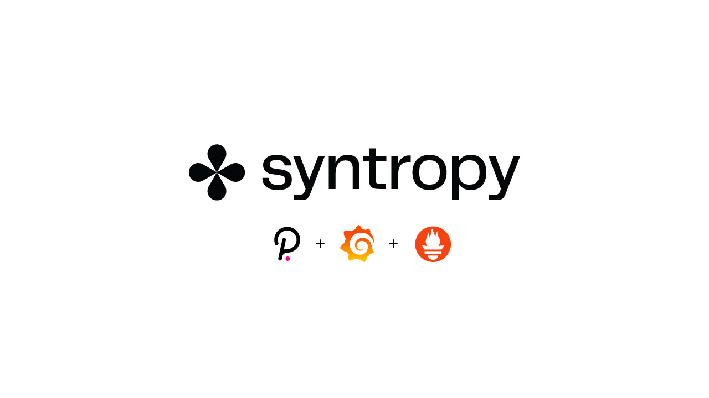
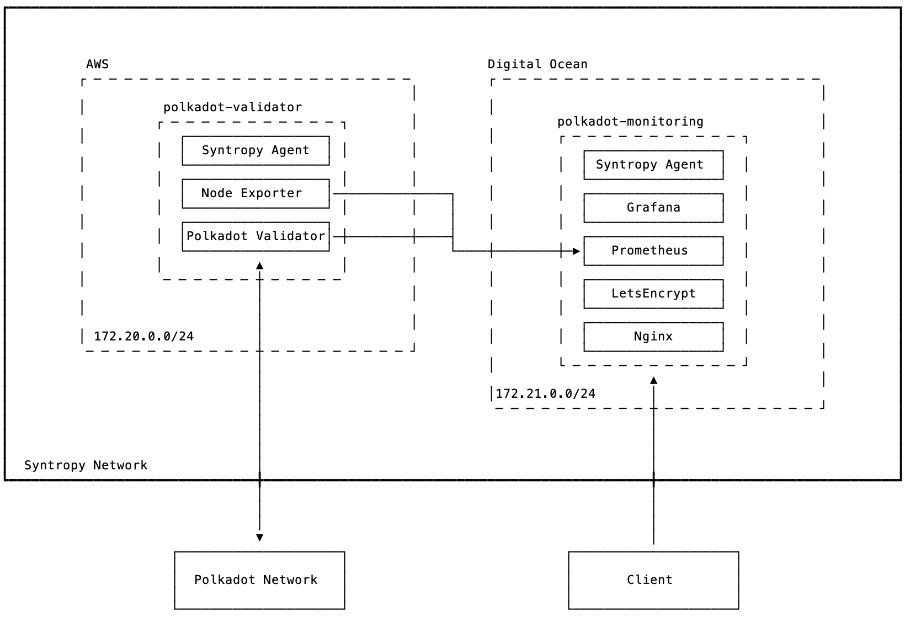
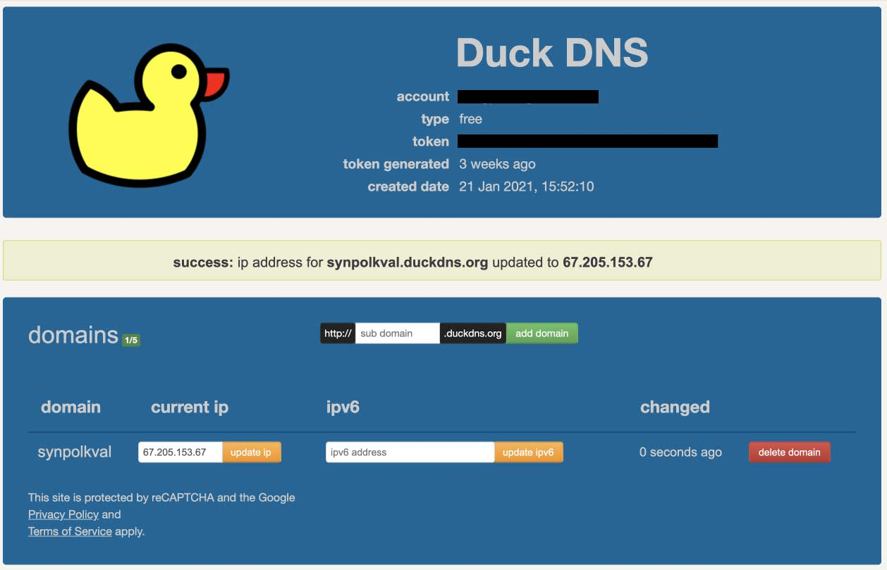
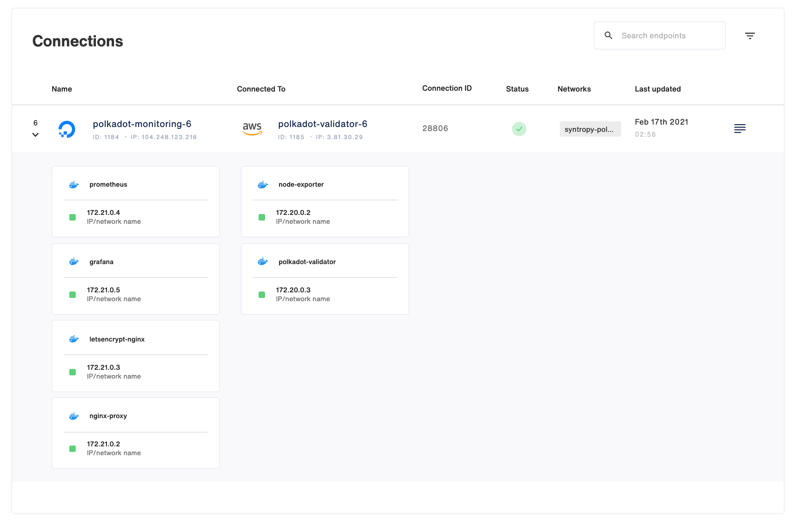
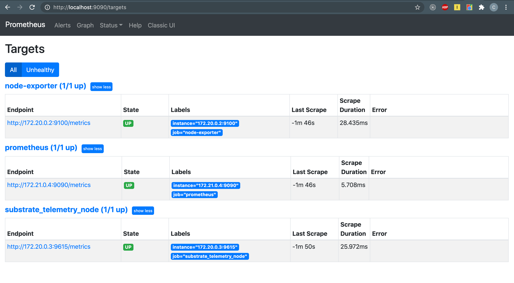
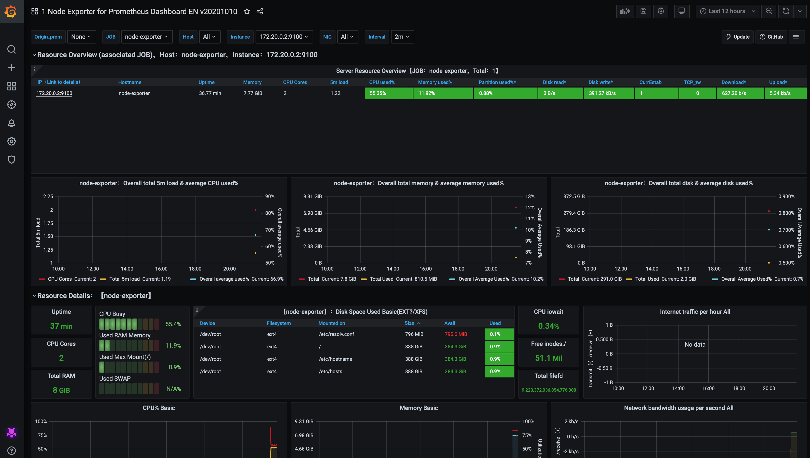
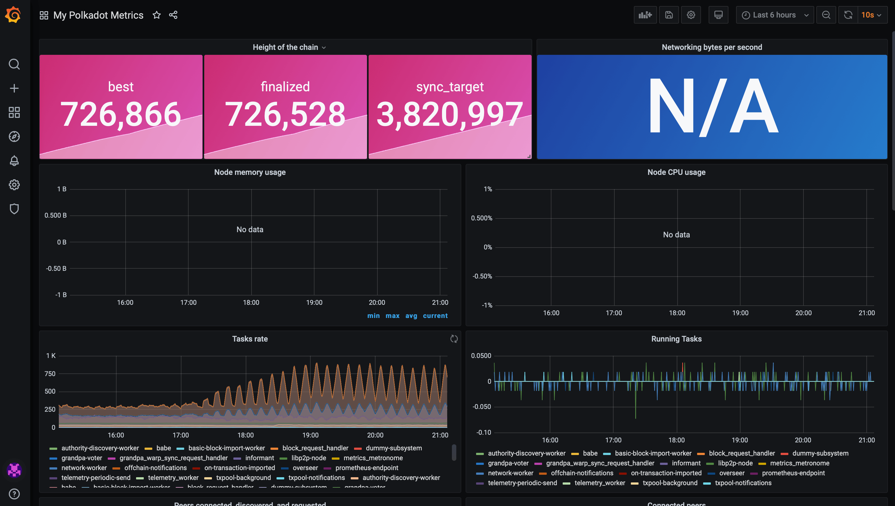

# Deplopy a Polkadot Validator Node with monitoring using Syntropy

Security is paramount when running a validator node. For this reason, the Polkadot documentation recommends following the [secure validator setup guide](https://github.com/w3f/polkadot-secure-validator) to set up a node. This repo follows the same approach, but has been customized to isolate every service inside a docker container and uses the Syntropy Stack to securely connect the Validator to the monitoring infrastructure. This guide deals exclusively with creating the infrastructure and bringing the node online, it does not cover Polkadot-specific details such as setting Session Keys, network validation, or bonding DOT. Details on how to do this can be found in the [Polkadot Wiki](https://wiki.polkadot.network/docs/en/maintain-guides-how-to-validate-polkadot).

## System Architecture

This guide does not take into account high availability set-ups involving redundant validators. An approach involving redundancy is risky - if it's not done correctly and session keys are shared between nodes, it can lead to equivocation slashes, or even parachain validity slashes (which can result in the loss of 100% of your staked DOT).



The diagram above outlines our system's architecture. We host our Validator Node and Monitoring Node on separate Virtual Machines (VMs). Thanks to Syntropy, these are running on separate cloud service providers. Our monitoring stack consists of Prometheus and Grafana. Nginx is used as a proxy to route traffic all web traffic to the Grafana service over port 443. LetsEncrypt provides the SSL certificate for HTTPS. Nginx is also used to enable basic authentication for accessing the Grafana UI. The Validator node is running the [parity/polkadot](https://hub.docker.com/r/parity/polkadot) service, along with Node Exporter that feeds metrics about the VM to Prometheus.

You can make use of any cloud service providers supported by Syntropy ( list can be found [here](https://docs.syntropystack.com/docs/syntropy-agent-variables) ). The Terraform templates for this repo use AWS for the Validator and Digital Ocean for the Monitoring node. You can use different providers, but you will need to update the Terraform templates accordingly.

## Security & Possible attack surfaces

Syntropy adds additional security by default. All traffic between the VMs passes through encrypted VPN tunnels, and no unneccessary ports are exposed to the public internet, in addition to living behind the firewall. Syntropy also prevents against attacks by VMs on the same hardware by isolating services within a private SDN (software defined network).

The usual security best practises apply, especially for SSH access. You can find a good introduction to SSH security [here](https://stribika.github.io/2015/01/04/secure-secure-shell.html).

In relation to Polkadot, managing your session keys correctly, and storing them securely, is crucial to running a validator node. Because session keys are not account keys, an attacker would not be able to transfer funds if they got hold of them. However, an attacker could use them to commit slashable behaviour and potentially cause you to lose all your staked DOT.

# How Syntropy makes the secure validator setup even easier

When it comes to monitoring your Validator Node, [the Polkadot documentation](https://wiki.polkadot.network/docs/en/maintain-guides-how-to-monitor-your-node) is thorough, but is out of sync with the [Secure Validator Setup guide](). The need for Sentry nodes has been deprecated, and the Polkadot service ( docker image ) now automatically emits metrics on port 9615, so there is no need for [Substrate Telemetry]() and [Substrate Telemetry Exporter]() as stated in the secure validator setup. This repo makes the deployment of a Validator Node as simple as a few steps, utilizing Terraform to create the Infrastructure and Ansible to provision the hosts, deploy the services, and create the network.

Syntropy guarantees the most stable, efficient and secure connection between your Validator and your Monitoring node. This is done by constantly checking the health of three distinct routes between your VMs (one public route and two Syntropy routes) and switching over to a healthy route if one is dead. Because three routes are used for data transmission, there is also the added benefit of minimized latency, since the Syntropy Agent will automatically switch to the healthiest route (depending on your parameters - latency, packet loss).

# Prerequisites

- A [Syntropy Stack account](https://www.syntropystack.com/) and an active [Agent Token](https://docs.syntropystack.com/docs/get-your-agent-token)
- Ansible > 2.9.17
- Terraform ( > 13.0, < 14.0 )
- AWS account
- Digital Ocean account

# Prepare the Syntropy Stack

Install the Syntropy CLI. Additional info can be found in the docs, [here](https://docs.syntropystack.com/docs/syntropy-ctl-installation).

`pip3 install syntropycli`

Rename the `ansible/sample.yaml.secrets` file to `ansible/secrets.yaml` and add your Agent Token (generated via Syntropy UI) to the `api_key` variable.

Add the Api Server URL to your environment (it is recommended it to add it to your .bashrc or .zshrc depending on your shell of choice).

`export SYNTROPY_API_SERVER=https://controller-prod-server.syntropystack.com`

Next, we need to generate an API Token (not to be confused with your Agent Token).

Generate an API Token by logging in using the CLI:

`syntropyctl login {syntropy stack user name} { syntropy stack password}`

Copy the API token and add it to your ENV, for example via your .bashrc file. You'll need to add the API URL, as well as your username in password.

```
export SYNTROPY_API_TOKEN="your_syntropy_api_token"
export SYNTROPY_PASSWORD="your_syntropy_password"
export SYNTROPY_USERNAME="your_syntropy_username"
```

If Ansible is not already installed, you can do so using pip3. Make sure it installs version >= 2.9.17

`pip3 install ansible`

Install the Syntropy Ansible Galaxy Collection.

`ansible-galaxy collection install git@github.com:SyntropyNet/syntropy-ansible-collection.git`

Navigate to your local ansible directory, for example on Mac OS:

`cd /Users/{user}/.ansible/collections/ansible_collections/syntropynet/syntropy`

Install the Python dependencies.

`pip3 install -U -r requirements.txt`

# Terraform setup

In order for Terraform to authenticate for your cloud providers, you will need to enable programmatic access to each. It's recommended to create a project-specific SSH key. Eg.

```
ssh-keygen -m pem -f ~/.ssh/polkadot_validator_rsa
```

Next, rename `terraform/terraform.tfvars.sample` to `terraform/terraform.tfvars`. All references to variables in this section can be found in this file.

**Digital Ocean**

- A personal access token set to the `do_token` variable.
- The location of your SSH private key set to `pvt_key`

**AWS**

- An IAM user for programmatic access with Administrator priviliges (do not use this for production, you should restrict the scope of any production IAM user's access). Add the credentials to your `~/.aws/credentials` file.

Eg.

```
[syntropy]
aws_access_key_id="your_access_key_here"
aws_secret_access_key="your_secret_access_key_here"
```

- Set the `ssh_public_key` variable to the location of your SSH public key.
- Give the key-pair a name and set `ec2_keypair_name` (this is what it will appear as in AWS)

### How to run your nodes

1. Clone the repository

```
git clone git@github.com:SyntropyNet/syntropy-blockchain-integrations.git
cd polkadot-validator
```

2. Prepare the Syntropy Stack (as shown above)

3. Prepare the Terraform templates (as shown above).

4. Create your infrastructure plan (you'll need to enter a value of `yes` after running this command).

```
cd terraform
terraform plan
```

5. Apply your plan (you'll need to enter a value of `yes` after running this command).

```
terraform apply
```

6. When Terraform completes, open the `ansible/inventory` file and copy the IP address from the `[monitoring]` host's ansible_host.

Eg.

```
[monitoring]
polkadot-validator ansible_host=67.205.153.67 # <=== copy "67.205.153.67"
```

Login to [DuckDNS](https://www.duckdns.org/) using your Gmail, Github or Twitter account.

Create a unique subdomain and set the `current ip` to the IP address you copied from the Ansible Inventory.



Edit your `ansible/secrets.yaml` file by updating the `duck_dns_domain` with your newly created domain. Set new credentials for `htpasswd_user` and `htpassd_password` and generate credentials for `htpasswd_credentials` using [this online tool](https://www.web2generators.com/apache-tools/htpasswd-generator).

For a production validator, you'll likely want to use a domain that you own for this step.

7. Deploy the services and create the Syntropy network

```
cd ansible
ansible-playbook main.yaml -i inventory
```

Confirm your network is online by visiting the Syntropy UI `Networks` section and checking the connections.



8. Access your Grafana UI by navigating to `https://{your_subdomain}.duckdns.org` in your browser and entering the credentials you used to create the `htpasswd_credentials` file in `ansible/secrets.yaml`.

9. Add Prometheus as a Data Source by hovering over the Configuration (cog) icon on the left-hand menu and clicking `Data Sources`. Click `Add data source`, select `Prometheus` and set the `URL` to `172.21.0.4:9090` and hit `Save & Test`.

10. You can check Prometheus is configured correctly by opening a tunnel to your VM using:

```
ssh -L 9090:<PROMETHEUS_DOCKER_IP>:9090 <monitoring_vm_user>@<monitoring_vm_ip>
```

Then you can access the Prometheus UI at `http://localhost:9090`. Navigate to `Status > Targets` and you should see the following:



11. Add the Node Exporter Dashboard by hovering over the Create (`+`) icon on the left-hand menubar and select `import`. In the `Import via grafana.com` input, enter the ID: `11074`, select Prometheus from the `VictoriaMetrics` dropdown and click `Import`.



12. Add the Polkadot Metrics Dashboard by hovering over the Create (`+`) icon on the left-hand menubar and select `import`. In the `Import via grafana.com` input, enter the ID: `12425`, select Prometheus from the `VictoriaMetrics` dropdown and click `Import`.



# Additional Considerations for a production Validator

This repo is intended as a demonstration of setting up a Polkadot validator using Syntropy, it is not intended to be used for running a Validator node on the Polkadot network verbatim. The following points are recommendations for some of the steps required to take it to production.

- You may want to increase the size of the EC2 instance to match the [Polkadot Recommendations](https://wiki.polkadot.network/docs/en/maintain-guides-how-to-validate-polkadot)
- The Digital Ocean VM uses the `root` account which is not recommended
- Grafana should be configured with AlertManager to help manage uptime
- The Grafana Polkadot Dashboard will not show Networking data until the Validator is actively participating in the network.
- Session keys, once created, should be backed up.
- Login credentials should be set for Grafana
- Docker containers should be set to start with systemd in the event of unexpected reboot
- Update the `validator_node_name` variable in `deploy_validator.yaml` to whatever you want your validator to be visible on the network as
- Generate session keys by running `ansible-playbook create_session_keys.yaml -i inventory`, these will need to be set by following [these instructions](https://wiki.polkadot.network/docs/en/maintain-guides-how-to-validate-polkadot)
- Install `ntp` on the validator node
